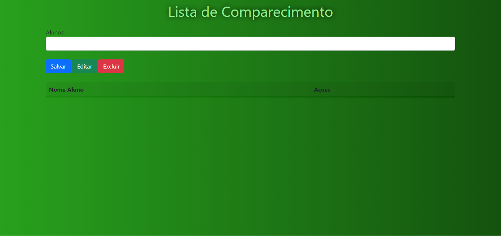

Codigo que utiliza um sistema com javascript que simula uma lista de comparecimento para os alunos
=======
# Índice

* [Descrição](#descri%C3%A7%C3%A3o)
* [Funcionalidades](#funcionalidade)
* [Tecnologias utilizadas](#tecnologias-utilizadas)
* [Fontes consultadas](#fontes-consultadas)
* [Autores](#autores)
 
 ## Descrição
* Codigo que utiliza um sistema com javascript que simula uma lista de comparecimento para os alunos
* [Voltar para o Índice](#%C3%ADndice)

 
## Funcionalidade
* Salvar
* Editar
* Excluir
* Guardar Dados
* [Voltar para o Índice](#%C3%ADndice)

 
### Tecnologias utilizadas
* `Git`
* `Git Hub`
* `Visual Estudio Code`
* `HTML`
* `CSS`
* `JavaScript`
* [Voltar para o Índice](#%C3%ADndice)

 
## Fontes consultadas
* `Git Hub`
* `Alura`
* [Voltar para o Índice](#%C3%ADndice)

 
## Autores
* Daniiekkk
* [Voltar para o Índice](#%C3%ADndice)
>>>>>>> 75f7de1453aedced3bd9f37a9ee4d7df0547509b
